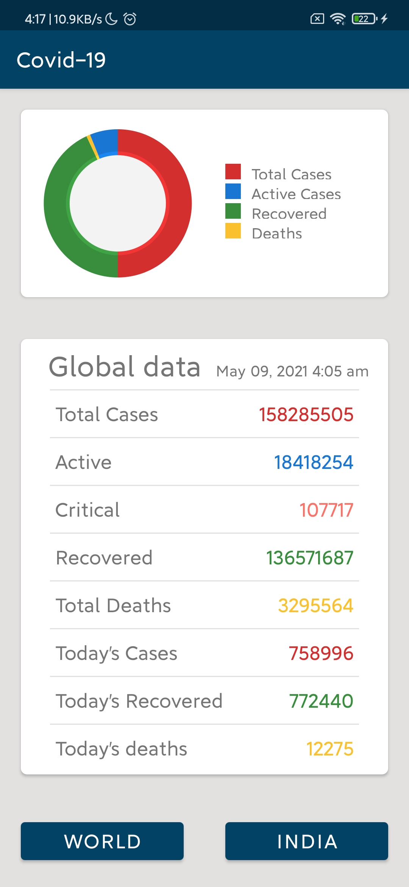
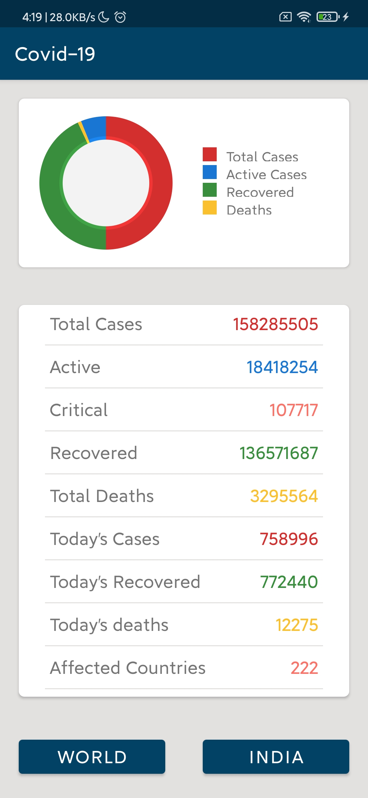
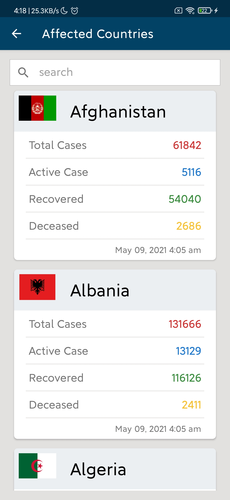
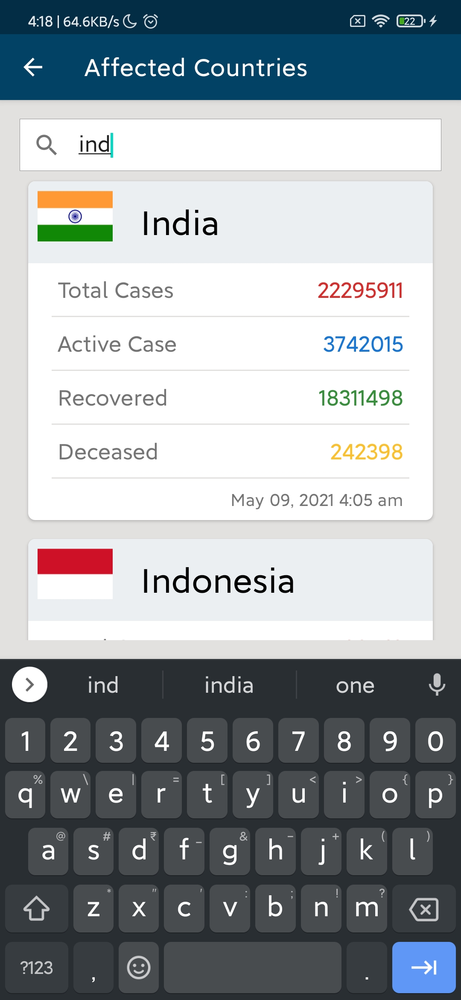
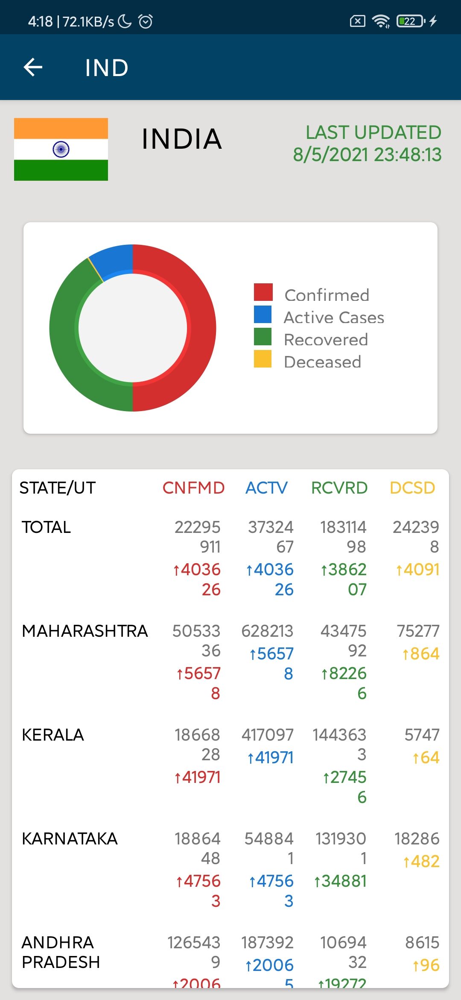
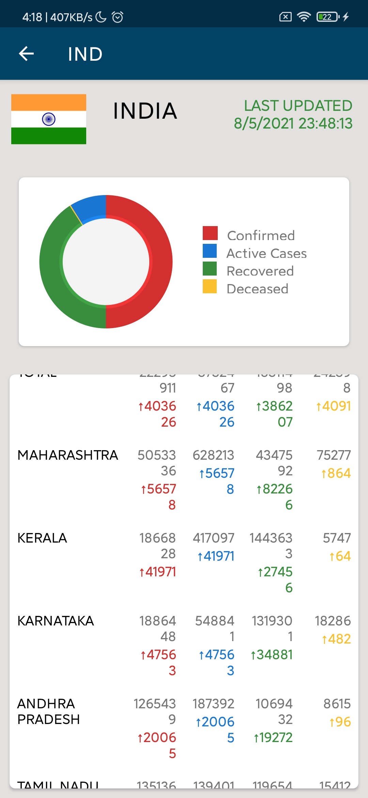

# Covid-19-Tracker
## An Android Application to track COVID-19 cases worldwide and India specific
#### Implemented with best practices like view recycling, networking etc. 
#### The app fetches latest COVID-19 stats from different APIs and is automatically updated periodically.
Technologies used: Android Studio, Java, Covid-19 API’s 

## Screenshots
 

